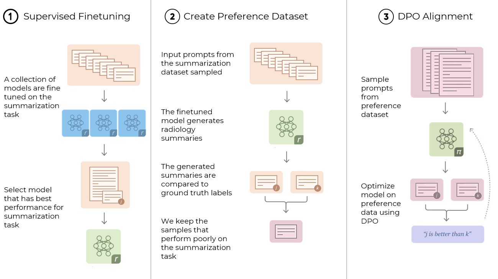

# Enhancing Radiology Report Summarizations Through Performance Feedback [(PDF)](https://github.com/varun-v-rao/Enhancing-Radiology-Report-Summarizations-Through-Performance-Feedback/blob/main/docs/Enhancing_Radiology_Report_Summarizations_Through_Performance_Feedback.pdf)

## Description:
This repository contains the implementation and resources for a novel approach to enhancing radiology report summarization through performance feedback. Leveraging state-of-the-art Large Language Models (LLMs) like GPT-2, BART, and LLaMA, this project aims to streamline the process of distilling crucial insights from extensive radiological investigations into concise and accurate summaries. By addressing concerns such as factual inconsistency and hallucination issues exhibited by LLMs, our approach combines supervised fine-tuning with reinforcement learning techniques to align these models with the task of radiology report summarization.

## Key Features:

* Fine-tuning Pipeline: We provide scripts and documentation for fine-tuning transformer-based LLMs on radiology report summarization tasks, tailoring them for the clinical domain.

* Synthetic Preference Dataset Generation: Explore our methodology and code for generating synthetic preference-based datasets, eliminating the need for extensive human annotation efforts.

* Direct Preference Optimization (DPO): Dive into the implementation of DPO, a reinforcement learning technique used to refine model alignment with preferred summaries, improving factual consistency and accuracy.

* Evaluation and Metrics: Evaluate the performance of fine-tuned and DPO-aligned models using standard evaluation metrics such as RougeL, F1-RadGraph, and F1-CheXbert on both in-domain and out-of-domain datasets.

## Contributing:
We welcome contributions from the research and development community to further enhance our approach, expand dataset generation techniques, and improve model alignment strategies. Feel free to submit pull requests, open issues, or engage in discussions to collaborate on advancing radiology report summarization methods.

## Authors:

Varun Venkat Rao
University of Michigan - EECS Department

## Contact:
For inquiries or collaboration opportunities, please reach out to Varun Venkat Rao at varu@umich.edu.
